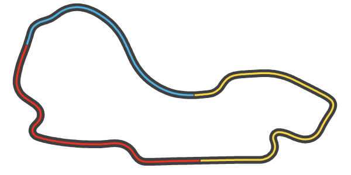
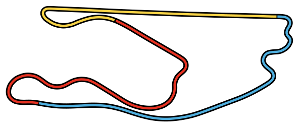
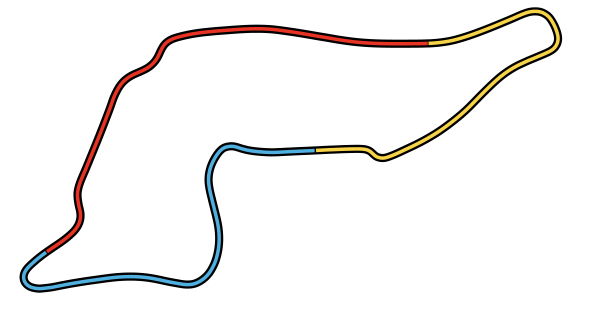

# f1_svg

F1 Track SVGs
Updated for 2022

Created using UDP Packets captured from F1 2022 Game (Codemasters)

### Bahrain

### Saudi Arabia

### Australia

### Azerbaijan

### United States

### Italy

### Monaco

### Catalunya

### Canada

### Austria

### Great Britain

### Hungary

### Belgium
![Spa Francorchamps, Belgium]Spa.svg "Spa-Francorchanps Belgium SVG")
