# F1 Track SVGs 2022 / 2023

F1 Track SVGs
Updated for 2023

Created using UDP Packets captured from F1 2022 Game (Codemasters)

## 2023 Tracks
### Las Vegas

### Qatar

### Catalunya

### Singapore

## 2022 Tracks
### Bahrain
.svg "Sakhir Bahrain SVG")

### Saudi Arabia
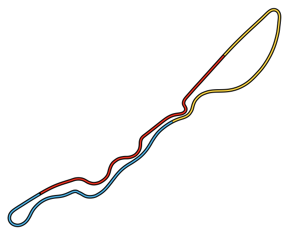

### Australia

### Azerbaijan
.svg "Baku Azerbaijan SVG")

### Catalunya
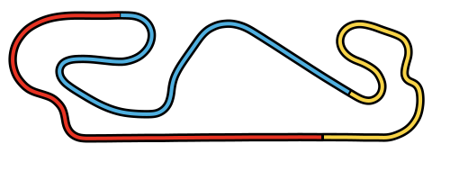

### United States

### Italy

### Monaco
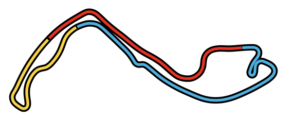

### Catalunya

### Canada
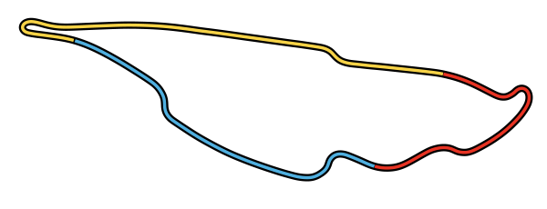

### Austria
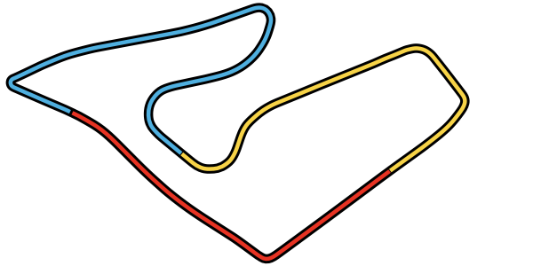

### Great Britain
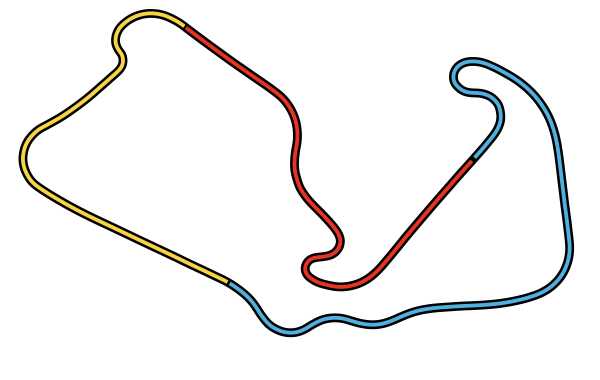

### Hungary
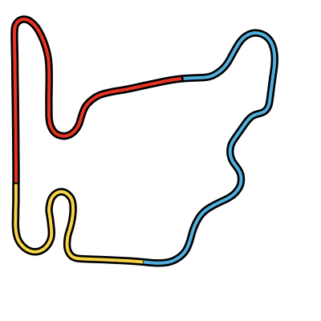

### Belgium
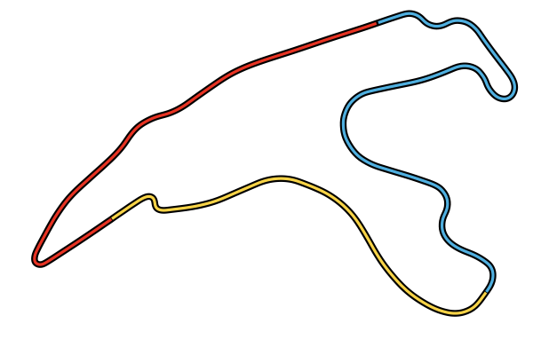

### Netherlands
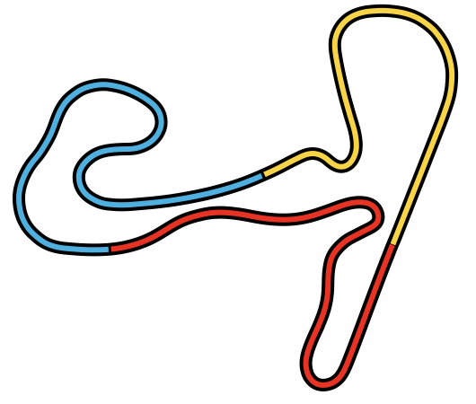

### Italy
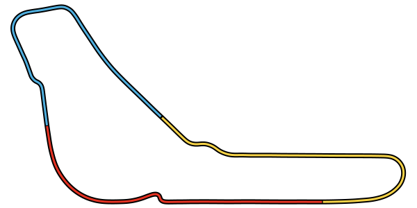

### Singapore
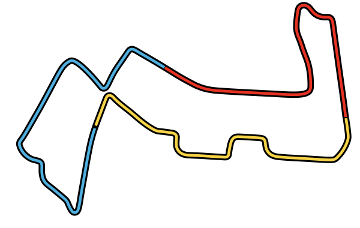

### Japan
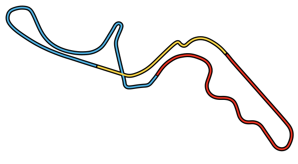

### United States
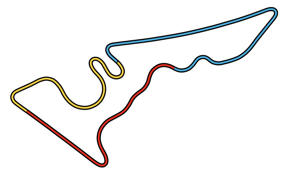 

### Mexico
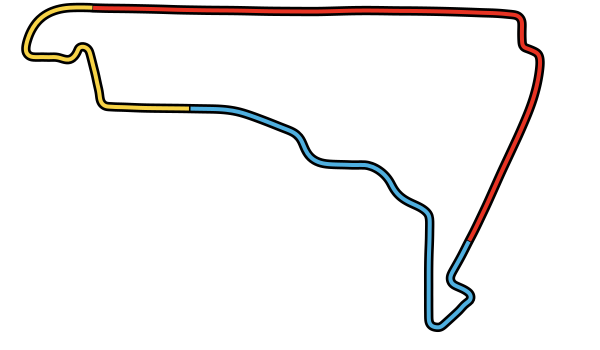

### Brazil
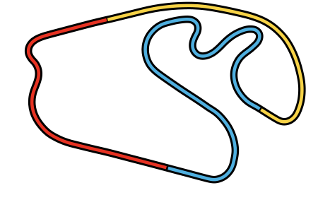

### Abu Dhabi

----
## Other Tracks

### Shanghai

### Portimao

### Paul Ricard

